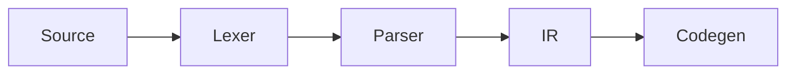

# Writing & configuration guide

Astro + Markdown. No database, no CMS — content lives as files under
`src/content/`, version control is git. `npm run build` produces static HTML.

## Running

```bash
npm install
npm run dev      # http://localhost:4321
npm run build    # static output into dist/
npm run preview  # serve the built output
npm run check    # type checking
npm run rebuild  # clear caches and build
```

> **Important:** Astro caches processed markdown under `.astro/` **and**
> `node_modules/.astro/`. When you change remark/rehype plugins in
> `astro.config.mjs`, content is not reprocessed — use `npm run rebuild`.
> The dev server shares the same cache; restart it after plugin changes.


## What the site is

A blog, in English and Turkish. One collection does the work:

| Path | What it is |
| --- | --- |
| `posts/<lang>/<slug>.md` | a post; the filename is its URL |
| `pages/<lang>/about.md` | the About page |

Tags are the only taxonomy. Every tag gets its own page at `/tags/<tag>/`,
listing the posts that carry it, and the home page shows the twelve most used.

The home page leads with whatever is marked `featured` — or, when nothing is,
with the newest two posts as cards. Everything after that falls into the list
below it, so no post is shown twice.

## Adding a post

From the repository root, which fills in the frontmatter and today's date:

```bash
npm run new -- en "Intermediate representations" --tags compilers,rust
npm run new -- tr "Ara temsiller" --key ir-notes --tags compilers,rust
```

| Option | Effect |
| --- | --- |
| `--tags a,b,c` | tags |
| `--key <key>` | translation key — the same in both languages |
| `--slug <slug>` | set the filename by hand |
| `--draft` | create as a draft |

Or in Obsidian, from `_templates/`: **Post (EN)** and **Yazi (TR)**.

Only `title`, `description`, `date` and `lang` are required. The full field
list, with defaults, is in `src/content/_templates/Ref — frontmatter.md`.

## Tags

Lowercase, hyphenated, and reused rather than invented: every distinct tag
becomes a page, so three spellings of one subject make three near-empty pages.

Most tags carry a pixel mark from the brand kit. The mapping lives in
`src/lib/pixel-icons.mjs` as an alias table — one entry per mark, listing every
tag name that should resolve to it, in both languages:

```js
'yengec-rust': ['rust', 'ferris', 'cargo'],
veritabani: ['database', 'db', 'sql', 'postgres', 'sqlite', 'mysql', 'redis'],
```

A tag with no entry gets the document mark (`icerik`) rather than nothing, so
every subject on the site has a face. To add a mark, drop the SVG into
`src/assets/brand/icons/` — it is picked up by filename, no registration — and
add its aliases to the table.

## Drafts

`draft: true` keeps a post out of the build, out of the feeds and out of the
search index. It still renders in `npm run dev`, so a draft can be read in
place before it is published.

## Featured posts

`featured: true` moves a post into the cards at the top of the home page. With
nothing marked, the newest two take that slot instead — so the home page never
looks empty, and marking one post does not require marking them all.

## Covers and images

Both optional. A post with neither still looks finished.

```yaml
cover: /assets/ir.png          # wide, above the body and on the card
ogImage: /assets/ir-card.png   # the social card; one is drawn if omitted
```

Paths are served from `public/`. Images a post embeds in its body go in
`src/content/_assets/` instead, where Astro resizes and re-encodes them at
build time — hand it the largest version you have.

## Sources

Frontmatter, not body. Rendered as a numbered list at the bottom of a post.
Only `title` is required:

```yaml
sources:
  - title: Engineering a Compiler          # required
    author: Keith Cooper, Linda Torczon    # optional
    url: https://example.com/book          # optional
    detail: 3rd ed., ch. 5                 # optional — pages, year, chapter
```

## Languages

`src/pages/tr/` mirrors the English routes exactly, and `src/i18n/ui.ts` holds
every string in both languages. There is no silent fallback: a post appears in
a language only when a file exists there.

English and Turkish posts keep their own slugs — a Turkish post gets a Turkish
URL. `translationKey`, identical in both files, is what links them:

```yaml
# posts/en/intermediate-representations.md
translationKey: ir-notes

# posts/tr/ara-temsiller.md
translationKey: ir-notes
```

The language switch in the header lands on the counterpart when there is one,
and on that language's home page when there is not.

## Math

`remark-math` + KaTeX.

Inline: `$e^{i\pi} + 1 = 0$`

Display math — **`$$` must be on its own line**, otherwise it parses as inline:

```markdown
$$
\angle APB = \tfrac{1}{2}\,\angle AOB
$$
```

### KaTeX macros

Shortcuts for common notation: `$\R$`, `$\N$`, `$\Z$`, `$\abs{x}$`,
`$\set{1,2}$`, `$\floor{x}$`, and for compiler posts
`$\judge{\Gamma}{e}{\tau}$` (→ Γ ⊢ e : τ), `$\derives$`, `$\steps$`, `$\lang$`.

Full list and how to add more: `src/lib/katex-macros.mjs`.

## For math, compilers and geometry

### Theorem / proof boxes

```markdown
:::theorem[Inscribed angle theorem]
An inscribed angle is half the central angle subtending the same arc.
:::

:::proof
… the proof …
:::
```

Available kinds and numbering:

| Kind | Numbered | Label (EN / TR) |
| --- | --- | --- |
| `theorem` `lemma` `proposition` `corollary` `definition` `example` `remark` | ✓ | Theorem / Teorem … |
| `proof` | — | Proof / İspat, ends with **□** |
| `note` `tip` `warning` | — | Note / Warning … |

Numbers are counted per file and per kind. The label language comes from the
post's `lang` frontmatter — nothing extra to write.

### Trees (ASTs, file trees, hierarchies)

Write an indented list; CSS draws the connector lines. It's a real `<ul>`,
so it stays copyable, searchable and screen-reader friendly:

```markdown
:::tree
- **Program**
  - **FunctionDecl** `"main"`
    - **Block**
      - **LetStmt** `"x"`
        - **IntLit** `42`
:::
```

`**bold**` is a node name, `` `code` `` gets the accent color, `*italic*` is
muted text.

### Diagrams (Mermaid)

````markdown

````

Mermaid is downloaded **only on pages that contain a diagram**, matches the
site theme automatically, and re-renders when the theme changes. Without
JavaScript the source stays visible as text.

### Numbered figures

```markdown
:::figure[Inscribed angle vs central angle]

:::
```

Renders with a "Figure 1 — …" caption and is linkable as `#fig-1`.

### Line annotations in code blocks

````markdown
```rust {2,5-7} showLineNumbers
```
````

| Syntax | Effect |
| --- | --- |
| ` ```rust {2,5-7} ` | Highlight those lines |
| ` ```rust /Node/ ` | Highlight a word |
| ` ```rust showLineNumbers ` | Line numbers |
| `// [!code highlight]` | Highlight the line |
| `// [!code ++]` / `// [!code --]` | Diff green / red |
| `// [!code focus]` | Dim everything else (hover restores) |
| `// [!code error]` / `[!code warning]` | Error / warning background |
| `// [!code word:Node]` | Highlight a word |

## Code blocks

Highlighting via Shiki. Three theme pairs are embedded at build time; CSS
decides which one shows — switching themes needs no JavaScript re-highlighting.

Fence options use **Obsidian's Codeblock Customizer syntax**, so the same fence
renders both in Obsidian (with that plugin) and on the site:

````markdown
```rust title:src/parser.rs hl:9-11 ln:true
```
````

| Syntax | Effect |
| --- | --- |
| `title:src/main.rs` | File-name bar above the block |
| `file:"long name.rs"` | Same; quote when the name has spaces |
| `hl:2,5-7` | Highlight those lines |
| `ln:true` | Line numbers |
| `ln:5` | Line numbers starting at 5 |
| `// [!code ++]` / `// [!code --]` | Diff green / red |
| `// [!code highlight]` | Highlight the line |
| `// [!code focus]` | Dim everything else (hover restores) |
| `// [!code error]` / `[!code warning]` | Error / warning background |
| `// [!code word:Node]` | Highlight a word |

The `[!code …]` markers are plain comments, so they stay harmless in Obsidian.

### File names and icons

A titled block gets a bar with the file name and an icon derived from the
fence language. Unrecognized languages get no icon.

### Copy button

On every block. On untitled blocks it appears in the corner on hover.
Hidden when JavaScript is unavailable.

## Search

The index is built by Pagefind after `astro build`, which is why `npm run
build` runs both. There is nothing to query while developing — the panel says
so rather than failing silently. Pagefind indexes `<main>` only and keeps one
index per language, so Turkish pages search Turkish content.

## Social cards

Every post gets a 1200×630 PNG at build time, drawn by satori from its own
title and description: `/og/posts/<slug>.png`, `/og/tr/posts/<slug>.png`, plus
`/og/site.png` for everything else. A post can override it with `ogImage`.
Fonts are read from `src/assets/fonts/` rather than fetched, so a build with no
network produces the same image.

## Deployment

Fully static output. Every push to `main` triggers the GitHub Actions
workflow (`.github/workflows/deploy.yml`) which builds and publishes to
GitHub Pages. No manual steps.

`src/consts.js` holds `url`, `author` and `github` — `url` feeds the
sitemap, RSS and canonical links.

## Structure

```
src/
  assets/brand/icons/  the pixel marks, inlined by filename
  components/          one job each; pages/ holds whole-page compositions
  content/             the markdown that becomes the site (an Obsidian vault)
  content.config.ts    the schema for both collections
  i18n/ui.ts           every string, both languages
  layouts/Base.astro   head, meta, header, footer
  layouts/Post.astro   a single post: header, body, contents, what comes next
  lib/posts.ts         every query the site makes over the posts
  lib/pixel-icons.mjs  tag -> mark
  pages/               routes; tr/ mirrors the English tree
  styles/global.css    tokens first, then components
public/                copied verbatim: CNAME, favicon.svg, brand/
scripts/new-post.mjs   the generator behind npm run new
```

`src/lib/posts.ts` is the only place that decides what a post list contains —
publication, ordering, tags, translations and neighbours all resolve there, so
a page never filters drafts on its own.
