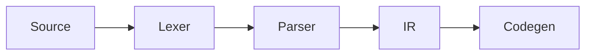

# Writing & configuration guide

Astro + Markdown. No database, no CMS required — content lives as files under
`src/content/`, version control is git. `npm run build` produces static HTML.

## Running

```bash
npm install
npm run dev      # http://localhost:4321
npm run build    # static output into dist/
npm run preview  # serve the built output
npm run check    # type checking
npm run rebuild  # clear caches and build
```

> **Important:** Astro caches processed markdown under `.astro/` **and**
> `node_modules/.astro/`. When you change remark/rehype plugins in
> `astro.config.mjs`, content is not reprocessed — use `npm run rebuild`.
> The dev server shares the same cache; restart it after plugin changes.

## New posts

Don't write frontmatter by hand:

```bash
npm run new -- en "The fifth postulate" --tags geometry,mathematics
npm run new -- tr "Öklid'in beşinci postülatı"
npm run new -- en "Title" --key my-translation-key   # translation key
npm run new -- en "Draft post" --draft
```

Creates the file in the right folder with valid frontmatter and prints its
path — editor-agnostic. Handles Turkish characters properly
(`Öklid'in beşinci postülatı` → `oklid-in-besinci-postulati`).

To open it directly in your editor:

```bash
nvim "$(npm run --silent new -- en 'Title')"
```

### Frontmatter fields

```markdown
---
title: Post title
description: One-sentence summary shown in lists and meta tags.
date: 2026-08-20
lang: en
tags: [compilers, rust]
translationKey: unique-key      # links EN/TR versions (optional)
draft: false                    # true → visible only in dev
toc: true                       # table of contents
comments: true                  # per-post comment toggle
sources:
  - title: Crafting Interpreters
    author: Robert Nystrom
    url: https://craftinginterpreters.com/
    detail: Part II
---
```

The schema is defined with Zod in `src/content.config.ts`. A missing or
mistyped field **fails the build** — content errors surface before deploy.

| Field | Required | Notes |
| --- | --- | --- |
| `title`, `description`, `date`, `lang` | yes | `lang`: `en` \| `tr` |
| `tags` | no | Lowercase, hyphenated; used verbatim in URLs |
| `translationKey` | no | Must be **identical** in both language files |
| `draft` | no | `true` → only `npm run dev` |
| `toc` | no | Default `true`; hidden with fewer than 2 headings |
| `sources` | no | See below |
| `updated` | no | Last-updated date |

## Sources

Rendered as a numbered list at the bottom of the post. Only `title` is
required:

```yaml
sources:
  - title: Engineering a Compiler          # required
    author: Keith Cooper, Linda Torczon    # optional
    url: https://example.com/book          # optional
    detail: 3rd ed., ch. 5                 # optional — pages, year, chapter
```

The `about.md` pages accept `sources` too.

## Linking translations

Put the same `translationKey` in both files:

```
src/content/posts/en/why-an-ir.md   → translationKey: why-an-ir
src/content/posts/tr/neden-ir.md    → translationKey: why-an-ir
```

The language link in the header then goes to the post's counterpart instead
of the other language's home page.

## Math

`remark-math` + KaTeX.

Inline: `$e^{i\pi} + 1 = 0$`

Display math — **`$$` must be on its own line**, otherwise it parses as inline:

```markdown
$$
\angle APB = \tfrac{1}{2}\,\angle AOB
$$
```

### KaTeX macros

Shortcuts for common notation: `$\R$`, `$\N$`, `$\Z$`, `$\abs{x}$`,
`$\set{1,2}$`, `$\floor{x}$`, and for compiler posts
`$\judge{\Gamma}{e}{\tau}$` (→ Γ ⊢ e : τ), `$\derives$`, `$\steps$`, `$\lang$`.

Full list and how to add more: `public/admin/katex-macros.mjs`. The file
deliberately lives there because it has two consumers — the build imports it
at compile time, and the CMS preview loads it in the browser — so the preview
and the published site can never drift apart.

## For math, compilers and geometry

### Theorem / proof boxes

```markdown
:::theorem[Inscribed angle theorem]
An inscribed angle is half the central angle subtending the same arc.
:::

:::proof
… the proof …
:::
```

Available kinds and numbering:

| Kind | Numbered | Label (EN / TR) |
| --- | --- | --- |
| `theorem` `lemma` `proposition` `corollary` `definition` `example` `remark` | ✓ | Theorem / Teorem … |
| `proof` | — | Proof / İspat, ends with **□** |
| `note` `tip` `warning` | — | Note / Warning … |

Numbers are counted per file and per kind. The label language comes from the
post's `lang` frontmatter — nothing extra to write.

### Trees (ASTs, file trees, hierarchies)

Write an indented list; CSS draws the connector lines. It's a real `<ul>`,
so it stays copyable, searchable and screen-reader friendly:

```markdown
:::tree
- **Program**
  - **FunctionDecl** `"main"`
    - **Block**
      - **LetStmt** `"x"`
        - **IntLit** `42`
:::
```

`**bold**` is a node name, `` `code` `` gets the accent color, `*italic*` is
muted text.

### Diagrams (Mermaid)

````markdown

````

Mermaid is downloaded **only on pages that contain a diagram**, matches the
site theme automatically, and re-renders when the theme changes. Without
JavaScript the source stays visible as text.

### Numbered figures

```markdown
:::figure[Inscribed angle vs central angle]

:::
```

Renders with a "Figure 1 — …" caption and is linkable as `#fig-1`.

### Line annotations in code blocks

````markdown
```rust {2,5-7} showLineNumbers
```
````

| Syntax | Effect |
| --- | --- |
| ` ```rust {2,5-7} ` | Highlight those lines |
| ` ```rust /Node/ ` | Highlight a word |
| ` ```rust showLineNumbers ` | Line numbers |
| `// [!code highlight]` | Highlight the line |
| `// [!code ++]` / `// [!code --]` | Diff green / red |
| `// [!code focus]` | Dim everything else (hover restores) |
| `// [!code error]` / `[!code warning]` | Error / warning background |
| `// [!code word:Node]` | Highlight a word |

## Code blocks

Highlighting via Shiki. Three theme pairs are embedded at build time; CSS
decides which one shows — switching themes needs no JavaScript re-highlighting.

Fence options use **Obsidian's Codeblock Customizer syntax**, so the same fence
renders both in Obsidian (with that plugin) and on the site:

````markdown
```rust title:src/parser.rs hl:9-11 ln:true
```
````

| Syntax | Effect |
| --- | --- |
| `title:src/main.rs` | File-name bar above the block |
| `file:"long name.rs"` | Same; quote when the name has spaces |
| `hl:2,5-7` | Highlight those lines |
| `ln:true` | Line numbers |
| `ln:5` | Line numbers starting at 5 |
| `// [!code ++]` / `// [!code --]` | Diff green / red |
| `// [!code highlight]` | Highlight the line |
| `// [!code focus]` | Dim everything else (hover restores) |
| `// [!code error]` / `[!code warning]` | Error / warning background |
| `// [!code word:Node]` | Highlight a word |

The `[!code …]` markers are plain comments, so they stay harmless in Obsidian.

### File names and icons

A titled block gets a bar with the file name and an icon derived from the
fence language. Unrecognized languages get no icon.

### Copy button

On every block. On untitled blocks it appears in the corner on hover.
Hidden when JavaScript is unavailable.

## Appearance menu

The gear button in the header holds three preferences, all stored in
`localStorage` and applied before first paint (no flash):

| Preference | Options |
| --- | --- |
| **Theme** | Minimal, Catppuccin, Gruvbox, Luxury, Modern, shadcn, Supabase, Vercel |
| **Code theme** | Vitesse, Catppuccin, Gruvbox |
| **Code font** | JetBrains Mono, IBM Plex Mono, Fira Code, System |

Light/dark is a separate toggle. Every theme defines both light and dark
palettes, and all 16 combinations pass WCAG AA contrast.

**Adding a theme:** one line in `src/consts.js`, two blocks in `global.css`
(`html[data-theme="x"]:not(.dark)` and `html[data-theme="x"].dark`). Nothing else.

**Adding a code theme:** one Shiki pair in `astro.config.mjs`, one rule in
`global.css`, one line in `consts.js`.

## Tag icons

Tags get icons by name — `src/components/TagIcon.astro`, shared set in
`src/lib/icons.mjs`. Language icons are official **simple-icons** (CC0) logos:
Rust, Python, PHP, C, C++, Go, JavaScript, TypeScript. Topic icons
(compilers, mathematics, geometry, psychology, books, languages…) are
hand-drawn line icons. Unknown tags fall back to a `#` mark.

`ALIASES` folds spelling variants into one key (`c++` → `cpp`, `matematik` →
`mathematics`).

Tags and code-block tabs use the same official logos. Ferris (Rust's crab
mascot, CC0) is in the set but not the default — reachable via the `ferris`
tag or `resolveIcon(name, { mascot: true })`.

Code fences also derive an icon from their language; unrecognized languages
get none (no meaningless `#` in a tab).

## Writing from the browser (optional)

**Sveltia CMS** is set up under `public/admin/` — a Git-based editor that
runs in the browser. Frontmatter becomes form fields; the sources array is
point-and-click.

The architecture matters: the admin page is a **static file** under
`public/`. Astro copies it as-is — it never enters the build and adds zero
bytes to the site bundle. Visitors never download it.

**Locally (no GitHub needed):**

```bash
npm run cms     # terminal A — local bridge
npm run dev     # terminal B
```

Then open `http://localhost:4321/admin/`. Changes are written straight to
disk; you make the commits.

**In production:** point `repo` in `public/admin/config.yml` at the GitHub
repository. Sveltia signs in via GitHub OAuth (needs a small OAuth proxy —
not set up yet; local mode is fully functional).

**Math preview works.** Sveltia knows no KaTeX by itself; this repo's
`public/admin/preview-math.js` uses Sveltia's two official hooks —
`window.marked` (the very parser the preview uses) is extended with a KaTeX
plugin, and `CMS.registerPreviewStyle` injects the KaTeX CSS into the preview
iframe. Macros come from the **same file** as the site, so `$\R$` renders in
the preview exactly as published. `preview-style.css` additionally themes the
preview to match the site's typography.

> **Note:** the content field defaults to **raw** mode. Rich-text editors
> parse and rewrite markdown; this repo's `:::theorem`, `:::tree` and code
> fence meta (`title=`, `group=`, `[!code ++]`) are not standard markdown and
> can be mangled. These custom blocks render as plain text in the preview —
> their true preview is the site itself via `npm run dev`.

### Why not Keystatic / TinaCMS

| | Issue |
| --- | --- |
| **Keystatic** | `@keystatic/astro@6` doesn't work with this Astro version (`astro:env/server` fails to resolve) — tried, reverted |
| **TinaCMS** | Requires React + its own backend (database or Tina Cloud); its rich-text editor is risky for our custom blocks |
| **GitCMS** | Hosted and paid; no setup needed, you connect the repo on their site |

## Comments

**Giscus** (GitHub Discussions) is wired up but disabled. To enable, in
`src/consts.js`:

1. Make the repo public and enable Discussions (Settings → Features)
2. Install the app: github.com/apps/giscus
3. Get `repoId` and `categoryId` from giscus.app
4. Set `GISCUS.enabled = true`

The iframe follows theme changes automatically. Disable per post with
`comments: false`.

## Languages

- English at the root: `/`, `/posts/`, `/tags/`
- Turkish under `/tr/`: `/tr/`, `/tr/posts/`, `/tr/tags/`

UI strings live in `src/i18n/ui.ts`. When adding a string, add it to both
languages — TypeScript errors on missing keys.

## Deployment

Fully static output. Every push to `main` triggers the GitHub Actions
workflow (`.github/workflows/deploy.yml`) which builds and publishes to
GitHub Pages. No manual steps.

`src/consts.js` holds `url`, `author` and `github` — `url` feeds the
sitemap, RSS and canonical links.

## Structure

```
src/
├── consts.js              site settings, themes, Giscus config
├── content.config.ts      Zod schemas (the frontmatter contract)
├── content/
│   ├── posts/{en,tr}/     posts
│   └── pages/{en,tr}/     standalone pages
├── i18n/ui.ts             UI strings + helpers
├── lib/                   icons, post queries, remark/rehype plugins
├── layouts/               Base, Post
├── components/            TOC, Sources, PostList, Header, Appearance…
│   └── pages/             page bodies (shared by EN and TR routes)
├── pages/                 routes — EN at root, TR under /tr/
└── styles/global.css      all styles, 8 themes
scripts/new-post.mjs       post scaffolding (npm run new)
public/admin/              Sveltia CMS + KaTeX macros (shared with build)
```
