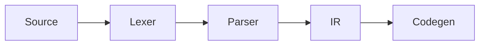

# Writing & configuration guide

Astro + Markdown. No database, no CMS — content lives as files under
`src/content/`, version control is git. `npm run build` produces static HTML.

## Running

```bash
npm install
npm run dev      # http://localhost:4321
npm run build    # static output into dist/
npm run preview  # serve the built output
npm run check    # type checking
npm run rebuild  # clear caches and build
```

> **Important:** Astro caches processed markdown under `.astro/` **and**
> `node_modules/.astro/`. When you change remark/rehype plugins in
> `astro.config.mjs`, content is not reprocessed — use `npm run rebuild`.
> The dev server shares the same cache; restart it after plugin changes.

## What the site is

A project showcase. Each project has an overview and any of these sections:

| Section | Backed by | Shape |
| --- | --- | --- |
| `readme` `architecture` `structure` `state` `learned` | `docs/` | free markdown |
| `changelog` `releases` | `releases/` | one file per version |
| `roadmap` | `roadmaps/` | milestones with checklists |
| `benchmarks` | `benchmarks/` | measured comparisons, drawn as bars |
| `decisions` | `decisions/` | numbered records, never rewritten |

Any other id works too, as long as `docs/<lang>/<slug>/<id>.md` exists.

The home page and `/changelog/` merge every project's releases into one feed,
which is also the site's only RSS.

## Adding a project

Don't write frontmatter by hand:

```bash
npm run new:project -- voparser --mono vp --accent "#7e22ce"
npm run new:project -- "My Tool" --status experiment --draft
```

This writes four files — the project and an empty roadmap, in **both**
languages — so English and Turkish never drift apart. Flags:

| Flag | Default | Notes |
| --- | --- | --- |
| `--name` | the argument | Display name; the slug comes from the argument |
| `--accent` / `--accent-dark` | the house orange | Six-digit hex, quoted |
| `--mono` | first two letters | 1–3 characters for the project mark |
| `--status` | `active` | `active` · `stable` · `maintenance` · `experiment` · `archived` |
| `--draft` | off | Visible in `npm run dev`, absent from the build |

Turkish input is handled properly: `"Öklid Aracı"` → `oklid-araci`.

## Adding a release

```bash
npm run new:release -- voparser 0.1.0
npm run new:release -- voparser 1.0.0 --kind major --date 2026-09-01
npm run new:release -- voparser next  --unreleased
```

One file per language under `releases/<lang>/<slug>/`. `--unreleased` marks work
in flight: it is pinned to the top of the changelog and labelled *Unreleased*
instead of showing a version.

The body is free markdown. `### Added` / `### Changed` / `### Fixed` is what the
styling expects, but nothing enforces it.

## Adding a section

```bash
npm run new:doc -- voparser architecture
npm run new:doc -- voparser profiling --title "Profiling" --title-tr "Profil"
```

`readme`, `architecture`, `structure`, `state` and `learned` are labelled from
the translations and already have an icon. A custom id needs `--title`,
otherwise the tab shows the raw id; give it a mark with `glyph:` in the file's
frontmatter (any name from `src/lib/icons.mjs`).

## Benchmarks

One file per project: `benchmarks/<lang>/<slug>.md`. The environment block is
required — a number without the machine, the flags and the input it came from
is a claim, not a measurement.

```yaml
environment:
  machine: AMD Ryzen 7 5800X, 32 GB, NVMe
  os: Debian 12, kernel 6.1
  toolchain: gcc 12.2, -O2, single thread
  input: 500 pages, 4.1 MB median
  method: 30 runs, first 5 discarded, median reported
suites:
  - title: Parse to document
    unit: ms
    lowerIsBetter: true          # false for throughput
    results:
      - label: voParser
        value: 41.2
        mine: true               # marks your own implementation
      - label: lexbor
        value: 33.8
        note: faster, and it stayed faster
```

Bars are drawn against the largest value in the suite, and the winner is
marked rather than implied. A suite needs at least two results — a benchmark
against nothing is a number, not a comparison. Put what the numbers mean in the
body underneath; that is the part worth reading.

## Decisions

One file per decision: `decisions/<lang>/<slug>/<nnn>-<name>.md`.

```yaml
number: 3
title: Persistent connections per runner
date: 2026-08-11
status: accepted               # proposed | accepted | superseded | reverted
supersedes: [2]                # numbers this replaces
supersededBy: 7                # the one that replaced this
tags: [transport, performance]
```

Records are never rewritten. When a decision stops holding, mark the old one
`superseded`, point it at the new number, and write the new record — the site
links them in both directions and fades the one that no longer applies.
`## Context / ## Options / ## Decision / ## Consequences` is the shape the
styling expects.

## Which sections appear

By default, every section that has content — a docs file that exists, a
changelog with at least one release, a roadmap with at least one milestone. An
empty section is never linked.

To pin the order, or to switch one off, list them in the project's frontmatter:

```yaml
sections: [readme, changelog, roadmap]
```

Named ids that have no content are still dropped, so the list is safe to write
ahead of the files.

## Colours and artwork

A project declares two colours:

```yaml
accent: "#d9480f"       # light mode — must clear 4.5:1 on a pale background
accentDark: "#ff5e1f"   # dark mode — the lighter of the two
```

`Base.astro` writes them onto `<body>`, and every page of that project is
repainted: the monogram, links, the tab underline, checkboxes, progress bars.
One house layout, a different identity inside it per project.

A project's mark has three levels, in order of precedence:

```yaml
icon: ../../_assets/voparser-icon.png   # an image file
glyph: code                             # a name from src/lib/icons.mjs
monogram: vp                            # one to three characters
```

`glyph` is usually enough: the icon set carries marks for sections, tools and
concepts, and the same names resolve in `stack:` too, so `stack: [Go, Docker,
PostgreSQL]` picks up three icons without any extra work.

Cover art is generated from the same parts as the site — frame rules, corner
squares, the project's mark in its own colour, and its own light and dark
palette:

```bash
npm run new:cover -- vocloud --glyph server --accent "#0e7490" --accent-dark "#22d3ee"
```

Then point at it, in both language files:

```yaml
cover: ../../_assets/vocloud-cover.svg   # wide, above every page of the project
card:  ../../_assets/vocloud-card.svg    # the index card; falls back to cover
```

Photographs work the same way — put them in `src/content/_assets/` and Astro
resizes and re-encodes them at build time, so hand it the largest version you
have.

## Sources

Rendered as a numbered list at the bottom of an overview or a documentation
section. Only `title` is required:

```yaml
sources:
  - title: Engineering a Compiler          # required
    author: Keith Cooper, Linda Torczon    # optional
    url: https://example.com/book          # optional
    detail: 3rd ed., ch. 5                 # optional — pages, year, chapter
```

## Languages

`src/pages/tr/` mirrors the English routes exactly, and `src/i18n/ui.ts` holds
every string in both languages. A project appears in a language only when it has
a file there — there is no silent fallback to English, which is why the
generators always write both.

The language switch in the header lands on the counterpart page when one exists,
and on that language's home page when it does not.

## Math

`remark-math` + KaTeX.

Inline: `$e^{i\pi} + 1 = 0$`

Display math — **`$$` must be on its own line**, otherwise it parses as inline:

```markdown
$$
\angle APB = \tfrac{1}{2}\,\angle AOB
$$
```

### KaTeX macros

Shortcuts for common notation: `$\R$`, `$\N$`, `$\Z$`, `$\abs{x}$`,
`$\set{1,2}$`, `$\floor{x}$`, and for compiler posts
`$\judge{\Gamma}{e}{\tau}$` (→ Γ ⊢ e : τ), `$\derives$`, `$\steps$`, `$\lang$`.

Full list and how to add more: `public/admin/katex-macros.mjs`. The file
deliberately lives there because it has two consumers — the build imports it
at compile time, and the CMS preview loads it in the browser — so the preview
and the published site can never drift apart.

## For math, compilers and geometry

### Theorem / proof boxes

```markdown
:::theorem[Inscribed angle theorem]
An inscribed angle is half the central angle subtending the same arc.
:::

:::proof
… the proof …
:::
```

Available kinds and numbering:

| Kind | Numbered | Label (EN / TR) |
| --- | --- | --- |
| `theorem` `lemma` `proposition` `corollary` `definition` `example` `remark` | ✓ | Theorem / Teorem … |
| `proof` | — | Proof / İspat, ends with **□** |
| `note` `tip` `warning` | — | Note / Warning … |

Numbers are counted per file and per kind. The label language comes from the
post's `lang` frontmatter — nothing extra to write.

### Trees (ASTs, file trees, hierarchies)

Write an indented list; CSS draws the connector lines. It's a real `<ul>`,
so it stays copyable, searchable and screen-reader friendly:

```markdown
:::tree
- **Program**
  - **FunctionDecl** `"main"`
    - **Block**
      - **LetStmt** `"x"`
        - **IntLit** `42`
:::
```

`**bold**` is a node name, `` `code` `` gets the accent color, `*italic*` is
muted text.

### Diagrams (Mermaid)

````markdown

````

Mermaid is downloaded **only on pages that contain a diagram**, matches the
site theme automatically, and re-renders when the theme changes. Without
JavaScript the source stays visible as text.

### Numbered figures

```markdown
:::figure[Inscribed angle vs central angle]

:::
```

Renders with a "Figure 1 — …" caption and is linkable as `#fig-1`.

### Line annotations in code blocks

````markdown
```rust {2,5-7} showLineNumbers
```
````

| Syntax | Effect |
| --- | --- |
| ` ```rust {2,5-7} ` | Highlight those lines |
| ` ```rust /Node/ ` | Highlight a word |
| ` ```rust showLineNumbers ` | Line numbers |
| `// [!code highlight]` | Highlight the line |
| `// [!code ++]` / `// [!code --]` | Diff green / red |
| `// [!code focus]` | Dim everything else (hover restores) |
| `// [!code error]` / `[!code warning]` | Error / warning background |
| `// [!code word:Node]` | Highlight a word |

## Code blocks

Highlighting via Shiki. Three theme pairs are embedded at build time; CSS
decides which one shows — switching themes needs no JavaScript re-highlighting.

Fence options use **Obsidian's Codeblock Customizer syntax**, so the same fence
renders both in Obsidian (with that plugin) and on the site:

````markdown
```rust title:src/parser.rs hl:9-11 ln:true
```
````

| Syntax | Effect |
| --- | --- |
| `title:src/main.rs` | File-name bar above the block |
| `file:"long name.rs"` | Same; quote when the name has spaces |
| `hl:2,5-7` | Highlight those lines |
| `ln:true` | Line numbers |
| `ln:5` | Line numbers starting at 5 |
| `// [!code ++]` / `// [!code --]` | Diff green / red |
| `// [!code highlight]` | Highlight the line |
| `// [!code focus]` | Dim everything else (hover restores) |
| `// [!code error]` / `[!code warning]` | Error / warning background |
| `// [!code word:Node]` | Highlight a word |

The `[!code …]` markers are plain comments, so they stay harmless in Obsidian.

### File names and icons

A titled block gets a bar with the file name and an icon derived from the
fence language. Unrecognized languages get no icon.

### Copy button

On every block. On untitled blocks it appears in the corner on hover.
Hidden when JavaScript is unavailable.

## The CMS

Content has two interchangeable sources, and they produce byte-identical
pages — same ids, same fields, same rendered markdown:

| Source | Where content lives | Build with |
| --- | --- | --- |
| `files` *(default)* | markdown under `src/content/` | `npm run build` |
| `cms` | Payload, in `cms/content.db` | `npm run build:cms` |

Payload is a **local editor, not a deployed service**. It runs only while you
are editing; the published site is still static HTML with no database behind
it. That is the whole reason for the SQLite file — it is committed with the
repository, so a build anywhere reproduces the same site.

```bash
npm run cms        # http://localhost:3001/admin
npm run dev:cms    # the site, read from the database
npm run build:cms  # static output from the database
```

The first run asks you to create an admin user; it is stored in the same file
and never leaves the machine.

### Moving content between them

```bash
npm run cms:import   # markdown  ->  database
```

Idempotent: records that exist are updated, not duplicated, so it can be re-run
after editing files. It never writes to `src/content/` — markdown stays exactly
as it is, which is what makes the switch reversible.

There is no export in the other direction yet. Whichever source you build from
is the one to edit; keeping both authoritative would need a merge strategy
nobody wants to debug.

### What Payload does not hold

Body text stays **markdown**, in a code field rather than a rich-text editor.
The site's pipeline runs remark and rehype over it — KaTeX, Shiki with its
fence metadata, mermaid, `:::tree` and `:::note`. A WYSIWYG editor would
rewrite all of that into markup the build no longer understands.

Artwork is a path, not an upload: `/assets/name.svg`, served from `public/`.

### Changing a collection

Edit the matching file under `cms/collections/`, then keep the two schemas in
step — `src/content.config.ts` is what actually validates content, in both
modes. A field that exists in only one of them is a field the other build will
reject or ignore.

```bash
npm run cms:types      # regenerate cms/payload-types.ts
npm run cms:importmap  # after adding a custom admin component
```

## Search

The index is built by Pagefind after `astro build`, which is why `npm run
build` runs both. There is nothing to query while developing — the panel says
so rather than failing silently. Pagefind indexes `<main>` only and keeps one
index per language, so Turkish pages search Turkish content.

## Social cards

Every project gets a 1200×630 PNG at build time, drawn by satori from the
project's own colour and mark: `/og/<slug>.png`, `/og/tr/<slug>.png`, plus
`/og/site.png` for everything else. Fonts are read from `src/assets/fonts/`
rather than fetched, so a build with no network produces the same image.

## Deployment

Fully static output. Every push to `main` triggers the GitHub Actions
workflow (`.github/workflows/deploy.yml`) which builds and publishes to
GitHub Pages. No manual steps.

`src/consts.js` holds `url`, `author` and `github` — `url` feeds the
sitemap, RSS and canonical links.

## Structure

```
src/
  components/          one job each; pages/ holds whole-page compositions
  content/             the markdown that becomes the site (an Obsidian vault)
  content.config.ts    the schema for all five collections
  i18n/ui.ts           every string, both languages
  layouts/Base.astro   head, brand colour, header, footer
  lib/projects.ts      the only place that decides what a project shows
  pages/               routes; tr/ mirrors the English tree
  styles/global.css    tokens first, then components
public/                copied verbatim: CNAME, favicon.svg
scripts/               the generators behind npm run new:*
```

`src/lib/projects.ts` is worth reading before changing anything: `projectNav()`
decides both the tab bar and the static paths, so a route cannot exist without a
tab pointing at it — or the reverse.
