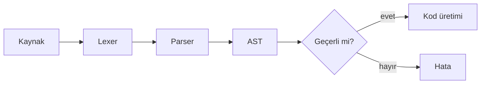

# Biçim

Sitede kullanabileceğin her biçim, tek sayfada. `_templates/` build tarafından
yok sayılır, yani bu dosya siteye çıkmaz — Obsidian'da açıp bakman için burada.

Kaynağını görmek için Obsidian'da **Ctrl+E** ile düzenleme moduna geç.

## Rust kodu

Başlık çubuğu, satır numarası ve vurgulanmış satırlarla:

```rust title:src/parser.rs ln:true hl:6-8
use std::iter::Peekable;

/// Pratt ayrıştırıcısının çekirdeği: sol tarafı oku, sonra bağlama gücü
/// yettiği sürece sağa doğru genişlet.
fn expr(p: &mut Parser, min_bp: u8) -> Expr {
    let mut lhs = atom(p);

    while let Some((l_bp, r_bp)) = p.peek().and_then(binding_power) {
        if l_bp < min_bp {
            break;
        }
        let op = p.next().unwrap();
        let rhs = expr(p, r_bp);
        lhs = Expr::Binary(Box::new(lhs), op, Box::new(rhs));
    }

    lhs
}
```

Satır içi işaretlerle — eklenen, silinen ve hatalı satırlar:

```rust title:src/lexer.rs
fn number(&mut self) -> Token {
    let start = self.pos;
    while self.peek().is_ascii_digit() {
        self.bump();
    }
    let text = &self.src[start..self.pos];      // [!code ++]
    let value: u64 = text.parse().unwrap();     // [!code --]
    let value: u64 = text.parse().unwrap_or(0); // [!code ++]
    Token::Int(value)
}
```

Kısa bir kabuk komutu, başlıksız:

```bash
cargo build --release && ./target/release/parse examples/expr.txt
```

Metnin içinde `binding_power()` gibi kısa parçalar da doğal duruyor.

## Matematik

Satır içi: bağlama gücü çifti $(l_{bp}, r_{bp})$ ile gösterilir ve sol
birleşimli bir işleç için $l_{bp} < r_{bp}$ olur.

Ayrı satırda:

$$
\text{expr}(p, m) \;=\;
\begin{cases}
  \text{atom}(p) & l_{bp} < m \\[4pt]
  \text{Binary}\big(\text{lhs},\, op,\, \text{expr}(p, r_{bp})\big) & \text{aksi hâlde}
\end{cases}
$$

Hizalanmış:

$$
\begin{aligned}
  T(n)   &= 2\,T(n/2) + \Theta(n) \\
  T(n)   &= \Theta(n \log n)
\end{aligned}
$$

Makrolarla: $\R$, $\N$, $\abs{x}$, $\set{1, 2, 3}$, $\floor{n/2}$.

:::theorem[Bağlama gücü tekliği]
Her ikili işleç için $(l_{bp}, r_{bp})$ çifti $l_{bp} \neq r_{bp}$ koşulunu
sağlıyorsa, ayrıştırma ağacı tektir.
:::

:::proof
$l_{bp} < r_{bp}$ ise işleç sola, $l_{bp} > r_{bp}$ ise sağa birleşir.
Eşitlik dışlandığından belirsizlik kalmaz.
:::

## Görsel

Doğrudan gömme:


Numaralı ve bağlanabilir şekil olarak:

:::figure[Ayrıştırma boru hattı]

:::

## Ağaç

:::tree
- **Program**
  - **LetStmt** `"x"`
    - **Binary** `+`
      - **IntLit** `1`
      - **IntLit** `2`
:::

## Kutular

:::note
`draft: true` olan bir yazı akışlara ve arama dizinine de girmez.
:::

:::tip
Kod bloğu seçenekleri Obsidian Codeblock Customizer söz dizimi — aynı blok
Obsidian'da da böyle görünür.
:::

:::warning
`$$` kendi satırında olmazsa satır içi matematik olarak ayrıştırılır.
:::

## Tablo

| Kodlama | İşleç eklemek | Çerçeve |
| --- | --- | --- |
| Gramer | Yeni bir seviye | $\Theta(n)$ |
| Bağlama gücü | Tek satır | $\Theta(1)$ |

## Diyagram


