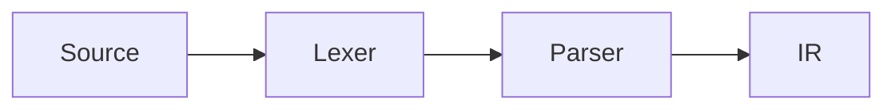

# Code blocks

Fence options use **Obsidian Codeblock Customizer** syntax, so the same fence
renders in Obsidian and on the site.

## Options

````markdown
```rust title:src/parser.rs hl:2,5-7 ln:true
fn main() {}
```
````

| Option | Effect |
| --- | --- |
| `title:src/main.rs` | File-name bar with a language icon |
| `file:"long name.rs"` | Same. Quote when the name has spaces |
| `hl:2,5-7` | Highlight those lines |
| `ln:true` | Line numbers |
| `ln:5` | Line numbers starting at 5 |
| *(nothing)* | Plain block, copy button on hover |

Order does not matter. Combine freely.

## Live examples

````markdown
```rust title:src/binding.rs
fn binding_power(op: &str) -> Option<(u8, u8)> {
    Some(match op {
        "+" | "-" => (1, 2),
        "^"       => (6, 5),
        _ => return None,
    })
}
```
````

```rust title:src/binding.rs
fn binding_power(op: &str) -> Option<(u8, u8)> {
    Some(match op {
        "+" | "-" => (1, 2),
        "^"       => (6, 5),
        _ => return None,
    })
}
```

With line numbers and a highlight:

```python title:solve.py ln:true hl:3
def solve(n):
    total = 0
    for i in range(n):       # this line is highlighted
        total += i * i
    return total
```

## Inline markers

Comments inside the code — harmless in Obsidian, styled on the site.

| Marker | Effect |
| --- | --- |
| `// [!code highlight]` | Highlight this line |
| `// [!code ++]` | Green, added |
| `// [!code --]` | Red, removed |
| `// [!code focus]` | Dim every other line (hover restores) |
| `// [!code error]` | Red background |
| `// [!code warning]` | Amber background |
| `// [!code word:Node]` | Highlight that word on the line |

```rust title:diff.rs
fn read(raw: &Map) -> Node {
    let mut extra = raw.clone();   // [!code --]
    let mut extra = Map::new();    // [!code ++]
    Node { extra }                 // [!code highlight]
}
```

Use `#` for Python/shell, `--` for SQL, `<!-- -->` for HTML.

## Languages with icons

`rust` `python` `php` `c` `cpp` `go` `javascript` `typescript` — these get a
logo in the title bar. Others get none, which is intentional.

Aliases work too: `c++` -> cpp, `js` -> javascript, `py` -> python.

## Mermaid

````markdown

````


Renders natively in Obsidian. On the site Mermaid loads **only** on pages that
contain a diagram, and follows the theme.
