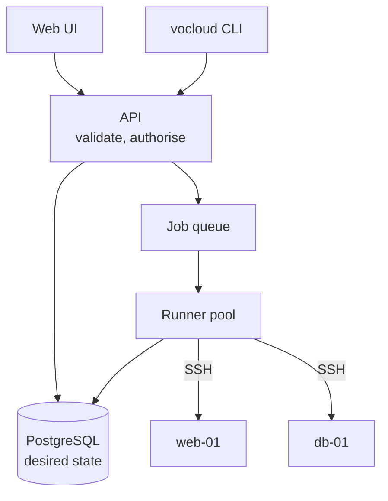

*Example content, to show what this section looks like.*

## Shape

## Layers

| Layer | Responsibility | Never does |
| --- | --- | --- |
| API | validation, authorisation, writing desired state | touch a host |
| Queue | ordering, retries, back-pressure | decide what a job means |
| Runner | connects, applies, reports | store anything |
| Store | desired state, observed state, audit log | run logic |

The direction only goes one way: nothing below the API writes to the API. A
runner that cannot reach the store drops its result into the queue's dead
letter, and the next `plan` shows the drift instead of losing it.

## Why a queue rather than a request

Applying a change to forty hosts takes minutes, not milliseconds. Holding an
HTTP request open for that long makes every timeout in the chain — proxy,
browser, load balancer — part of the operation's correctness. The queue
removes them from the path.
