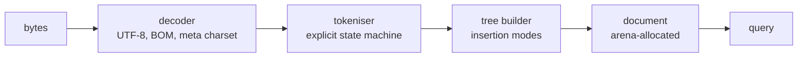
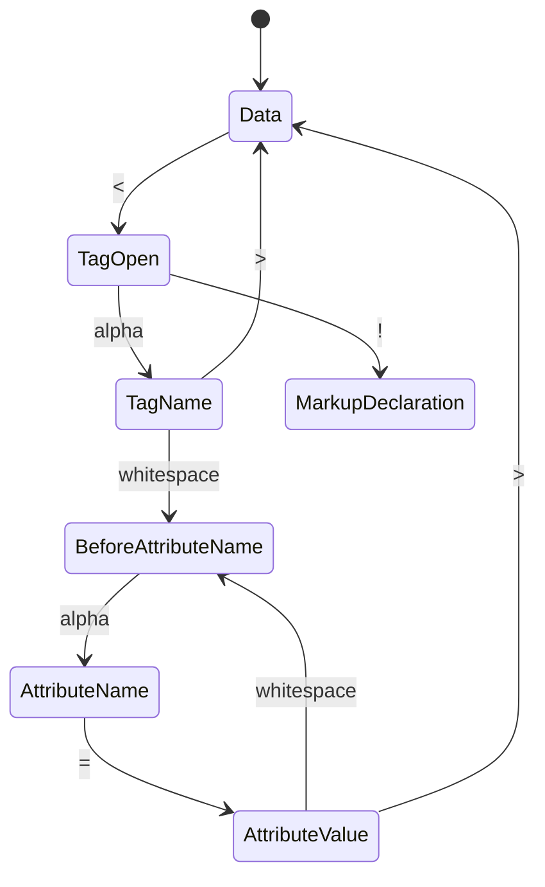

*Example content, to show what this section looks like.*

## Pipeline

## Tokeniser

The tokeniser is the specification's state machine written out, one function
per state, with the current state held in a variable rather than on the call
stack:

It never backs up. Every byte is consumed once, which is what keeps the parse
linear in input size and makes the cost model easy to reason about: one pass,
no re-scan, no lookahead beyond a single character.

## Tree builder

Insertion modes follow the specification, including the parts that exist only
because real documents are broken — the active formatting elements list and
its adoption agency algorithm. About a third of the code exists to handle
markup that no one would write on purpose but that every crawl encounters.
