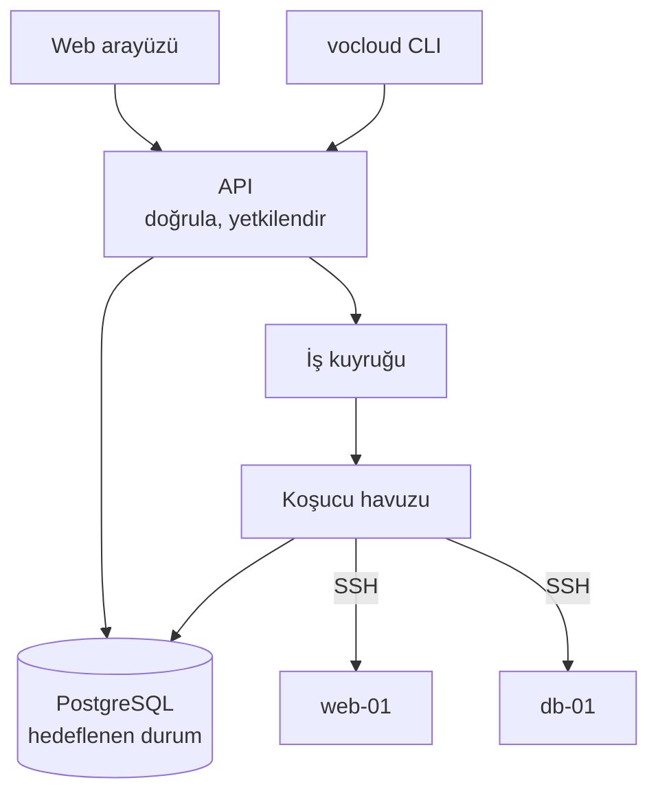

*Bu bölümün nasıl göründüğünü göstermek için örnek içerik.*

## Biçim

## Katmanlar

| Katman | Sorumluluk | Asla yapmaz |
| --- | --- | --- |
| API | doğrulama, yetkilendirme, hedef durumu yazma | makineye dokunmak |
| Kuyruk | sıralama, yeniden deneme, geri basınç | işin anlamına karar vermek |
| Koşucu | bağlanır, uygular, bildirir | bir şey saklamak |
| Depo | hedeflenen durum, gözlenen durum, denetim kaydı | mantık çalıştırmak |

Yön tek taraflı: API'nin altındaki hiçbir şey API'ye yazmaz. Depoya
ulaşamayan bir koşucu sonucunu kuyruğun ölü mektup kutusuna bırakır; sonraki
`plan` sapmayı kaybetmek yerine gösterir.

## Neden istek değil de kuyruk

Kırk makineye değişiklik uygulamak milisaniye değil dakika sürüyor. Bir HTTP
isteğini o kadar açık tutmak, zincirdeki her zaman aşımını — vekil sunucu,
tarayıcı, yük dengeleyici — işlemin doğruluğunun parçası yapar. Kuyruk onları
yoldan çıkarıyor.
