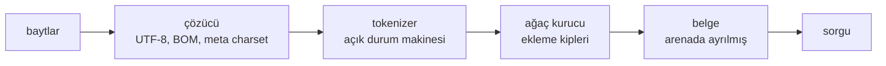
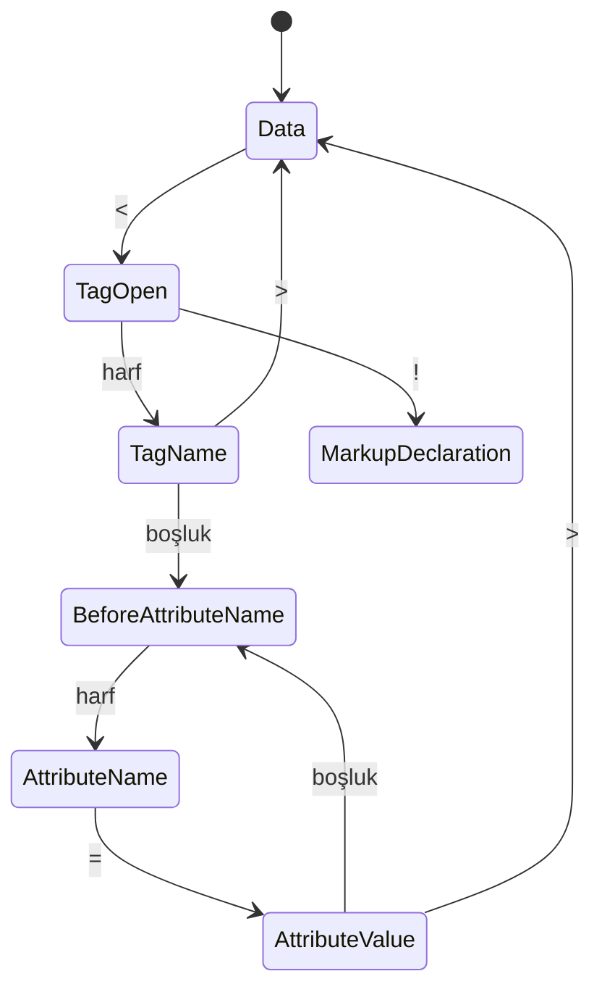

*Bu bölümün nasıl göründüğünü göstermek için örnek içerik.*

## Hat

## Tokenizer

Tokenizer, şartnamedeki durum makinesinin açık açık yazılmış hâli: her durum
için bir fonksiyon, ve mevcut durum çağrı yığınında değil bir değişkende
tutuluyor:

Hiç geri dönmüyor. Her bayt bir kez tüketiliyor; ayrıştırmayı girdi boyutunda
doğrusal tutan ve maliyet modelini kolay düşünülür kılan şey bu: tek geçiş,
yeniden tarama yok, tek karakterden fazla ileri bakma yok.

## Ağaç kurucu

Ekleme kipleri şartnameyi izliyor; yalnızca gerçek belgeler bozuk olduğu için
var olan kısımlar da dahil — etkin biçimlendirme elemanları listesi ve onun
evlat edinme algoritması. Kodun yaklaşık üçte biri, kimsenin bilerek yazmadığı
ama her taramada karşılaşılan işaretlemeyi karşılamak için var.
